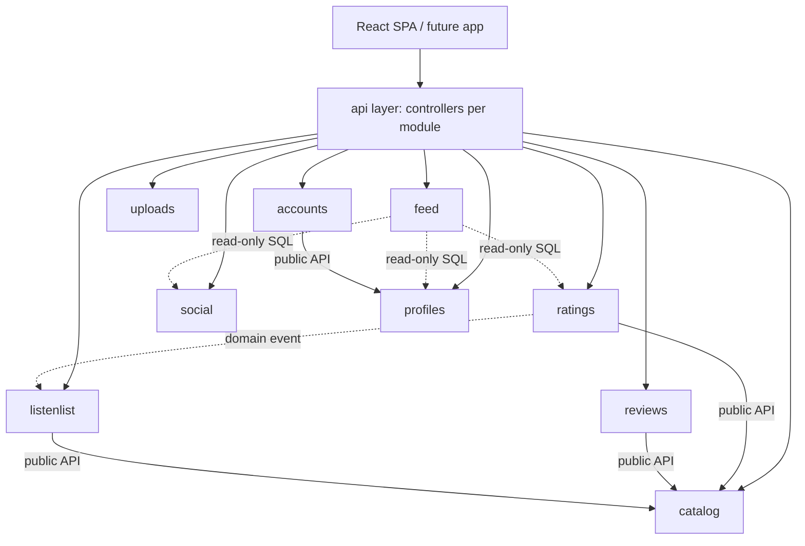
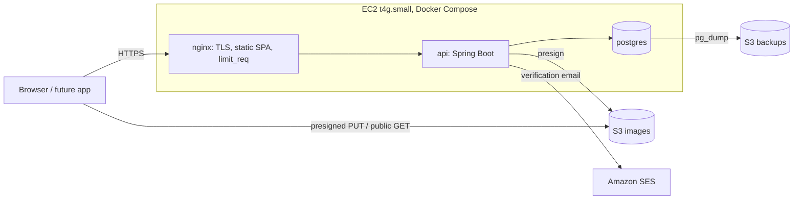
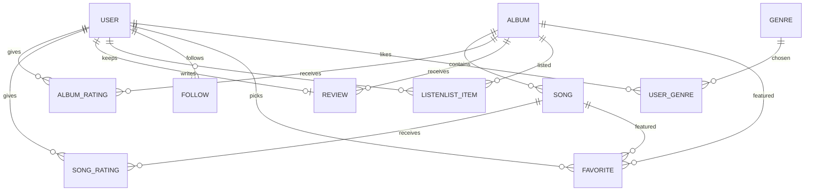

# Architecture Spine — Musicboxd

## Design Paradigm

**Modular monolith.** One Spring Boot deployable, split into domain modules with enforced boundaries. The React SPA and any future mobile app are clients of the same `/api/v1` contract.

Modules (one Java package and one Postgres schema each): `accounts`, `catalog`, `ratings`, `reviews`, `listenlist`, `social`, `profiles`, `uploads`, plus the read-only `feed`.



## Invariants & Rules

### AD-1 — Module boundaries and ownership [ADOPTED]

- **Binds:** all
- **Prevents:** hidden coupling; two modules owning or writing one entity
- **Rule:** Each module owns its schema and is the only writer of it. A module reads another module's data only through that module's public Java API (a package-level facade), never its tables or repositories. The single exception is `feed` (AD-3). Dependency direction is the diagram above; no cycles. Boundaries are enforced by an automated test that fails the build (Spring Modulith verification or ArchUnit), and by one Postgres role per module with grants only on its own schema (the `feed` role per AD-3).

### AD-2 — Cross-module effects are in-process domain events [ADOPTED]

- **Binds:** FR-8
- **Prevents:** inconsistent state between modules; one module calling another to trigger side effects
- **Rule:** A module that changes state others react to publishes a domain event; the event class lives in the publisher's package. Listeners run inside the originating transaction, fail closed (an exception rolls back the publisher), and are idempotent. No message queue in the MVP. `ratings` publishes "album rated"; `listenlist` removes that album from the user's Listenlist in the same commit. Adding an already-logged album to the Listenlist is rejected by `listenlist` through `ratings`' public API.

### AD-3 — `feed` is the only read-across module [ADOPTED]

- **Binds:** FR-10, FR-14
- **Prevents:** ad-hoc cross-schema queries spreading through the code
- **Rule:** `feed` may run read-only SQL over the `social`, `ratings`, `reviews`, `profiles`, `catalog`, and `accounts` schemas (Feed items need album title and cover, actor name and avatar; Profile recent activity). It never writes. Its DB role has `SELECT` only on those schemas. It converts stored ratings to the wire scale with the same single conversion routine as AD-5. The Feed is computed at read time with an indexed JOIN; no precomputed table until measured slow. Cursor order is (`created_at` DESC, `id` DESC); a rating that is updated counts as new activity and takes a new `created_at`.

### AD-4 — Ratings own scores; the album rating is the Log [ADOPTED]

- **Binds:** FR-5, FR-6, FR-8
- **Prevents:** two owners of a score; a computed album score; divergent meaning of "logged"
- **Rule:** `ratings` is the sole writer of album ratings and song ratings. There is no separate Log entity: an album is logged for a user iff that user has an album rating for it. Song ratings never imply a log. Album rating unique on (user, album); song rating unique on (user, song); independent; updated in place, no history. Nothing computes or exposes an album score derived from song ratings. The owner may delete their own album rating, which un-logs the album; deleting a rating publishes an event like any other change.

### AD-5 — Rating representation [ADOPTED]

- **Binds:** FR-5, FR-6
- **Prevents:** float rounding bugs; clients disagreeing on the scale
- **Rule:** Stored as integer 0..10 (each unit is half a star) with a database `CHECK`. The API contract carries a number 0..5 in steps of 0.5, validated at the edge; conversion happens only in the API layer.

### AD-6 — One review per user per album; hard deletes [ADOPTED]

- **Binds:** FR-7, FR-3
- **Prevents:** duplicate reviews; soft-deleted rows leaking into feeds
- **Rule:** Review unique on (user, album); only its author edits or deletes it. Deletion of user-owned content (ratings, reviews, follows, listenlist items) is a real `DELETE`; Staff removal of a user's Review is a real `DELETE` through `reviews`' own admin endpoint. No soft-delete columns for user content, no moderation flow in the MVP.

### AD-7 — API contract is the single client interface [ADOPTED]

- **Binds:** all
- **Prevents:** logic living only in the SPA; a mobile app that cannot reuse behavior
- **Rule:** All behavior is exposed under `/api/v1`, described by OpenAPI generated from the code (springdoc); the SPA's TypeScript client is generated from it. No business rule is implemented only in the client. Public `GET`s need no token; every write needs authentication; `/api/v1/admin/**` requires `STAFF`.

### AD-8 — Authentication and authorization [ADOPTED]

- **Binds:** FR-1, FR-2, FR-3
- **Prevents:** unrevocable tokens; client-trusted roles; users editing others' data
- **Rule:** Spring Security, email and password, no external identity provider. Passwords hashed with BCrypt or Argon2. Access token is a JWT of about 15 minutes. Refresh token is opaque, stored hashed in the DB, rotated on every use with reuse detection, revocable. On web the access token lives in memory and the refresh token in an `HttpOnly; Secure; SameSite` cookie, so SPA and API share one registrable domain. Roles `USER` and `STAFF` ride as a claim and are enforced only server-side. Every write verifies the resource belongs to the token's user. The refresh cookie is `SameSite=Lax`, scoped to the refresh endpoint path; refresh rotation tolerates a short grace window (about 10 seconds) so parallel requests or a lost response do not force a logout, and the SPA refreshes single-flight. Logout revokes that session's refresh token. Role changes take effect at the next access-token expiry. Email verification is required at signup; password recovery is deferred.

### AD-9 — Images go direct to S3 [ADOPTED]

- **Binds:** FR-11, FR-3
- **Prevents:** large uploads exhausting the small EC2; arbitrary object keys
- **Rule:** Client asks `uploads` for a presigned POST (a presigned PUT cannot enforce size), whose policy sets `content-length-range` and content type, uploads to S3, then confirms to `uploads`, which validates the key and hands it to the owning module (`profiles` or `catalog`) to store. The API accepts only keys it issued to that user for that purpose. Allowed types jpeg, png, webp with a maximum size per kind (avatar, cover, album art). The bucket has a CORS rule for the app origin, ACLs disabled, and a bucket policy granting public read on the image prefix only. Clients resize before upload. Images are served directly from S3 over HTTPS at the bucket domain; public read on the image prefix only, all other public access blocked. No CloudFront in the MVP.

### AD-10 — Cost and abuse guardrails are architecture [ADOPTED]

- **Binds:** all
- **Prevents:** a public, open-registration site running up the AWS bill
- **Rule:** Two rate-limit layers: nginx `limit_req` per IP, and Spring per-user limits on login, registration, email sending, and upload URL issuance. Request body and upload sizes are capped. AWS Budgets alerts at 50%, 80%, 100%. Any new AWS service needs a stated cost bound before adoption.

### AD-11 — Runtime topology and data safety [ADOPTED]

- **Binds:** NFR operations
- **Prevents:** exposed database; unrecoverable data loss; keys in code
- **Rule:** One EC2 host runs Docker Compose with three services: `api`, `postgres`, `nginx`. Only ports 80 and 443 are public; Postgres is reachable only on the internal Docker network; shell access via SSM or an IP-restricted SSH. The EC2 IAM role grants least privilege (image bucket, backup bucket, presigning); no static AWS keys anywhere. Postgres is backed up on a schedule with `pg_dump` to S3, bounded retention, and a restore that has actually been exercised. Certificate renewal is automatic, reloads nginx, and has an expiry alarm. Secrets live in environment files on the host outside the repository. Deploys come from CI (GitHub Actions) that builds arm64 images.

### AD-12 — Catalog entities are never deleted [ADOPTED]

- **Binds:** FR-3, FR-13
- **Prevents:** orphaned ratings, reviews, listenlist rows and favorites; cross-schema cascades that make `catalog` write other modules' tables
- **Rule:** Staff can create, edit, and hide albums and songs; there is no hard delete of catalog entities in the MVP, and hidden entities disappear from search but stay resolvable by id. Other modules reference catalog ids by id only, with no cross-schema foreign keys. Moving a song between albums is not supported. User account deletion is deferred.

### AD-13 — Profile identity, counts, and favorites [ADOPTED]

- **Binds:** FR-9, FR-11, FR-12, FR-13, FR-14
- **Prevents:** two owners of display identity or counters; divergent favorites rules
- **Rule:** `profiles` owns display identity (username, avatar, cover, bio). Follower and following counts are never stored; `social` computes them. The public Profile view is assembled by `feed` (read-only) from the owning modules. Genres come from a controlled list managed by Staff in `catalog`; `profiles` stores genre ids only. Favorites are 5 ordered slots for albums and 5 for songs, holding catalog ids, with no requirement that the user rated the item. Staff endpoints live in the module that owns the entity (`/api/v1/admin/<module>/**`).

## Consistency Conventions

| Concern | Convention |
| --- | --- |
| Naming | Java packages `com.musicboxd.<module>`; one Postgres schema per module named after it; REST paths plural nouns, kebab-case |
| Data & formats | Ids are opaque UUIDs on the wire; timestamps UTC ISO-8601; ratings per AD-5 |
| Errors | RFC 9457 Problem Details from every module |
| Pagination | Cursor pagination for long recency lists (Feed, recent ratings, recent reviews); numbered pages for short stable lists (catalog search) |
| Routing | Nest when the parent owns the child (`/albums/{id}/reviews`); flat with query parameters for cross-cutting queries |
| Search | Postgres `ILIKE` with a `pg_trgm` index for catalog and usernames; no external search engine |
| Migrations | Schema changes only through versioned Flyway migrations, one migration set and Flyway instance per module schema (Boot 4 needs `spring-boot-starter-flyway` plus `flyway-database-postgresql`) |
| State & cross-cutting | Transactions at the service layer; effects between modules per AD-2; structured logs to stdout, rotated on the host; config from environment variables |

## Stack

| Name | Version |
| --- | --- |
| Java | 25 (LTS) |
| Spring Boot | 4.1.1 |
| Spring Framework | 7 |
| PostgreSQL | 18 (current minor at build) |
| springdoc-openapi | 3.x (Spring Boot 4 line) |
| Flyway | current, via Spring Boot 4 starter |
| React | 19.3 |
| Vite | 8 |
| nginx | current stable image, tag pinned at build; TLS from Let's Encrypt via certbot |
| Dependency locking | exact versions in lockfiles (npm and Gradle/Maven), no floating ranges |
| Docker Compose | v2 |
| AWS region | us-east-1 |
| EC2 instance | t4g.small (arm64), JVM heap capped near 512 MB; move to t4g.medium if memory-bound |
| Amazon SES | production access required (sandbox exit), SPF and DKIM on the domain |

## Structural Seed





```text
musicboxd/
  api/      # Spring Boot app; one package per module (AD-1)
  web/      # React SPA (Vite); includes /admin area for Staff
  deploy/   # docker-compose, nginx config, backup scripts
```

Catalog is managed by Staff through an `/admin` area in the SPA over `/api/v1/admin/**`.

## Capability → Architecture Map

| Capability / Area | Lives in | Governed by |
| --- | --- | --- |
| FR-1 Guest browsing | api public GETs | AD-7, AD-8 |
| FR-2 Account creation and login | `accounts` | AD-8, AD-10 |
| FR-3 Staff catalog management | `catalog`, SPA `/admin` | AD-7, AD-8, AD-12 |
| FR-4 Catalog search | `catalog` | Search convention |
| FR-5 Log and rate an album | `ratings` | AD-4, AD-5 |
| FR-6 Rate individual songs | `ratings` | AD-4, AD-5 |
| FR-7 Review | `reviews` | AD-6 |
| FR-8 Listenlist | `listenlist` | AD-2, AD-4 |
| FR-9 Follow | `social` | AD-1, AD-13 |
| FR-10 Feed | `feed` | AD-3 |
| FR-11 Profile content and images | `profiles`, `uploads` | AD-9, AD-13 |
| FR-12 Favorite genres | `profiles`, genre list in `catalog` | AD-13 |
| FR-13 Favorites | `profiles` | AD-13 |
| FR-14 Public profile view | `profiles`, `feed` | AD-3, AD-13 |

## Deferred

- **Password recovery:** not in the MVP; revisit when real users lose access.
- **CloudFront and server-side image resizing:** revisit if image egress cost or latency hurts.
- **Precomputed Feed:** revisit only if the read-time JOIN measures slow.
- **Infrastructure as code (Terraform):** infra is built by hand first; revisit once the shape is stable.
- **Catalog data sources and imports, Follow Artists, likes and replies on Reviews:** PRD SHOULD/COULD, outside the MVP.
- **Mobile app token storage details:** app team decides, using Keychain/Keystore.
- **Region latency:** us-east-1 chosen for cost; revisit if Brazilian latency matters.
- **Observability beyond logs and an availability alarm:** revisit when there is something to debug.

## Open Questions

- Outbound email: SES sandbox exit timing, and SPF and DKIM setup, before signup verification can go live.
- Catalog data source and cover art licensing (PRD open question 1): the catalog is filled by hand until decided.
